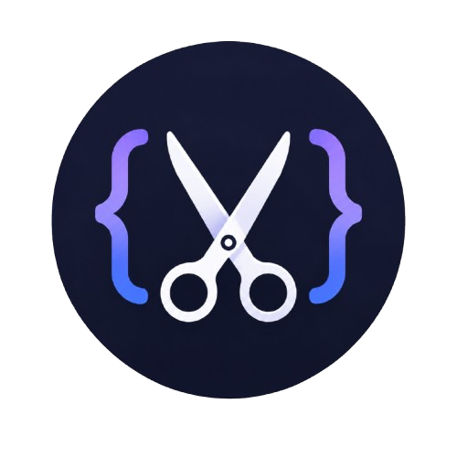

<p align="center">
  
</p>

<h1 align="center">SnippyCode</h1>

<p align="center">
  Private, self-hosted snippet management for commands, scripts, docs, raw install links, and team workflows.
</p>

<p align="center">
  <a href=".github/workflows/release.yml"></a>
  <a href="Dockerfile"></a>
  <a href="LICENCE.md"></a>
</p>

## What It Does

SnippyCode is a private code library for storing useful snippets, install commands, scripts, and implementation notes. It pairs a Monaco-powered editor with authentication, auditability, raw-link sharing, and GitHub sync so a small team can keep working code close at hand without making it public.

## Highlights

- First-run owner setup with required authentication
- Local accounts, roles, MFA, avatars, and Gravatar fallback
- Optional OIDC login with provider testing and account matching
- Monaco editor with language detection, formatting, docs, command palette, and theming
- Version history with visual diffs and restore
- Search across titles, docs, and code from Home and the library, including `collection:` filters
- Library collections you can browse like folders, plus language and tag filters, sortable by updated, title, or language
- Duplicate snippets from the library or detail page, and preview markdown docs while editing
- Keyboard shortcuts: `/` focuses search, `n` opens a new snippet
- Role-aware navigation and snippet actions, with admin role and account management
- Optional public snippet pages and keyless raw links, per snippet
- Gated server-side run for bash, Python, and Node snippets
- `snippycode` CLI for list, search, get, and raw fetch with the admin API key
- Per-snippet raw tokens with revoke and regenerate controls
- Admin raw API key for CI and curl install links
- Secret warnings before saving or syncing snippets
- Admin-configured Codex and Claude Code assistants. Admins sign in with ChatGPT and Claude from the website; editors generate snippet code, docs, and tags
- Admin tools for users, OIDC, GitHub sync, JSON import/export, Snippet Box migration, tasks, and audit logs
- PostgreSQL storage with Docker Compose healthchecks and backup profile
- Multi-architecture container releases through GitHub Container Registry

## Quick Start

```sh
cp .env.example .env
docker compose up -d
```

Open `http://localhost:5000`, complete the first-run owner wizard, then sign in.

Required production values:

```sh
SESSION_SECRET=replace-with-a-long-random-secret
POSTGRES_PASSWORD=replace-with-a-strong-db-password
```

## Local Development

```sh
npm run init
docker compose up -d postgres
npm run dev
```

The development servers run separately:

- Frontend (Vite dev server, proxies `/api` and `/raw` to the API): `http://localhost:3000`
- API/server: `http://localhost:5000`

Useful checks:

```sh
npm run build:tsc
npm run build --prefix client
docker build -t snippycode:local .
```

## Docker Compose

The included [docker-compose.yml](./docker-compose.yml) starts:

- `postgres`: PostgreSQL 16 storage
- `snippycode`: the Node API and built React client
- `postgres-backup`: optional backup profile

Run the released GHCR image:

```sh
SNIPPYCODE_IMAGE=ghcr.io/nerdy-technician/snippycode:latest docker compose up -d
```

Build locally instead:

```sh
docker compose up -d --build
```

Create a database backup:

```sh
docker compose --profile backup run --rm postgres-backup
```

Backups are written to the `postgres-backups` Docker volume.

## Reverse proxy

Point TLS (Caddy, nginx, Traefik) at the SnippyCode container, port 5000. Do not proxy to the Vite dev server on 3000; it is for local development only.

Build the client (Vite outputs to `client/dist`, which is copied into `public/`) before serving on 5000:

```sh
npm run build
```

```caddy
snippycode.example.com {
  reverse_proxy 127.0.0.1:5000
}
```

## Configuration

Core environment variables:

| Variable | Required | Purpose |
| --- | --- | --- |
| `SESSION_SECRET` | Yes | Signs auth sessions. Use a long random value in production. |
| `DATABASE_URL` | No | Full PostgreSQL connection URL. Compose sets this automatically. |
| `POSTGRES_DB` | No | Compose database name. Defaults to `snippycode`. |
| `POSTGRES_USER` | No | Compose database user. Defaults to `snippycode`. |
| `POSTGRES_PASSWORD` | Yes | Compose database password. |
| `SNIPPYCODE_PORT` | No | Host port for the app container. Defaults to `5000`. |
| `SNIPPYCODE_IMAGE` | No | Released image to run with Compose. |
| `SNIPPET_RUN_ENABLED` | No | Set `true` to allow editors to run bash, Python, or Node snippets on the server. |
| `SNIPPET_RUN_TIMEOUT_MS` | No | Runner timeout. Defaults to `15000`, max `60000`. |

Optional GitHub sync:

```sh
GITHUB_TOKEN=github_pat_...
GITHUB_REPO_OWNER=your-user-or-org
GITHUB_REPO_NAME=your-private-repo
GITHUB_REPO_BRANCH=main
GITHUB_SNIPPETS_PATH=snippets
```

The GitHub token needs contents read/write access to the target private repository.

## Roles

| Role | Access |
| --- | --- |
| `Viewer` | Read snippets and raw metadata. |
| `Editor` | Create, update, delete snippets, manage raw tokens, mark snippets public, and run snippets when enabled. |
| `Admin` | Manage server tasks, GitHub/OIDC/import/export/users. |
| `Owner` | Full access, including first-run ownership. |

## AI Assist

Owners and admins sign Codex and Claude Code in from Admin → AI Assist using the ChatGPT and Claude websites (Plus/Pro/Max subscriptions). Tokens stay on the server. Editors can then generate snippet code, docs, and tags from the editor.

## Import from Snippet Box

Owners and admins can pull every snippet from a running original Snippet Box instance (pawelmalak/snippet-box style `GET /api/snippets`) from Admin → Library. Enter the instance URL, an optional API key, and a collection name (default `Snippet Box`), then preview and confirm. SnippyCode fetches `/api/snippets` and hydrates `/api/snippets/:id` when list items omit code.

## Raw Links

Raw URLs use per-snippet tokens:

```text
/raw/install-docker.sh?key=SNIPPET_RAW_TOKEN
```

Tokens can be generated, copied, regenerated, and revoked from the snippet detail page. Copy the ready-made `curl -fsSL` command from the same dialog.

CI can also use an admin-managed raw API key as `?key=` or the `x-api-key` header. That key does not replace per-snippet tokens.

Mark a snippet public to share a read-only page at `/s/:slug`. Public snippets also allow `/raw/:slug` without a token.

## CLI

After `npm run build:tsc`, the `snippycode` binary talks to a running instance with the admin raw API key:

```sh
export SNIPPYCODE_URL=https://snippycode.example
export SNIPPYCODE_API_KEY=your-admin-raw-api-key

snippycode list
snippycode search nginx
snippycode get 12
snippycode raw install-docker.sh
```

You can also pass `--url` and `--key`.

## Server run

Server-side run is off by default. Editors can execute bash, Python, and Node snippets on the SnippyCode host only when you set:

```sh
SNIPPET_RUN_ENABLED=true
SNIPPET_RUN_TIMEOUT_MS=15000
```

Runs are timed out, written to a temp directory, and recorded in the audit log. They still execute on the same machine as SnippyCode, so only enable this on hosts you trust.
